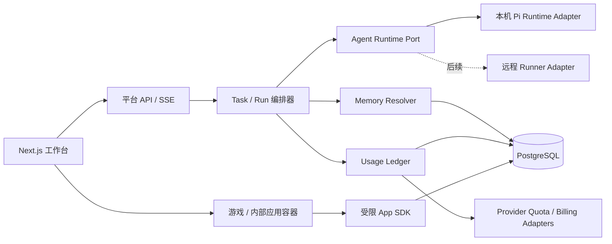

## 2026-08-18 15:50

# Pi Harness 平台技术方案（初版）

## 1. 技术方案概述

在 `GenshinProfession/pi-web` 的 `v0.8.9` 基础上进行渐进式二次开发。保留 Pi Web 已成熟的会话、SSE、工具调用、上下文、缓存命中和文件工作区能力；在其外围增加可审计的运行内核、分层记忆、用量账本、供应商额度适配器、任务中心，以及隔离的游戏/内部应用平台。

首期采用“模块化单体 + 明确端口”的方式，避免一开始拆成大量微服务；同时把中央控制面和 Pi 执行面在代码边界上分离，使后续可以把 Agent 执行节点部署到员工电脑或独立 Runner，而不重写记忆、计费与任务中心。

## 2. 当前代码研究结论

### 2.1 可以直接复用的底层能力

- `lib/rpc-manager.ts`：`AgentSessionWrapper` 是当前最重要的运行内核，集中管理 Pi `AgentSession`、并发启动锁、运行状态、空闲销毁、扩展 UI 和事件广播。
- `app/api/agent/[id]/events/route.ts`：单会话 SSE 事件流，可继续承载聊天、工具、任务和进度事件。
- `app/api/agent/running/events/route.ts`：已经能推送运行中的会话集合，可演进为全局任务进度流。
- `hooks/useAgentSession.ts`：已经处理断线重连、晚到事件、run id、压缩、队列和运行状态对账。
- `AssistantMessage.usage`：已有输入、输出、缓存读写和费用字段，适合成为计费账本的一个数据源。
- Pi Extension API：支持 `before_agent_start` 修改当轮系统提示，适合动态注入全局记忆；支持 `before_provider_request`、`after_provider_response`、`message_end`、`turn_end` 等事件，适合采集请求和用量。
- 扩展 UI：`setStatus`、`setWidget`、`custom` 已被 Pi Web 转成浏览器事件，可用于任务进度和游戏原型。

### 2.2 当前能力与目标之间的缺口

- `lib/workspace-memory.ts` 只是浏览器 `localStorage` 中的“工作区最后打开会话”，不是知识/规范记忆系统；后续应改名，避免概念冲突。
- 会话和配置以 `~/.pi/agent` 本地文件为中心，没有组织、用户、项目和权限模型。
- `globalThis.__piSessions` 只适用于单 Node 进程；无法直接支持多实例部署或远程执行节点。
- 费用是前端从消息 `usage` 临时汇总，没有请求级不可变账本、价格版本、币种、供应商原始计量和对账状态。
- 模型目录使用 `models.dev` 补充价格，但不能代表厂商真实余额、套餐额度或最终账单。
- 目前只有 Basic Auth，不适合企业多用户、RBAC 和审计。
- 扩展 `custom` UI 是文本/TUI 渲染桥，适合验证交互协议，不适合作为正式 Web 游戏发布容器。

## 3. 目标架构



### 3.1 分层原则

1. **表现层**：继续使用 Next.js/React，负责侧边栏、聊天、任务进度、记忆、计费和游戏中心界面。
2. **平台业务层**：新增任务、记忆、上下文预算、计费、权限和应用目录模块，不直接依赖 Pi SDK 类型。
3. **执行适配层**：把 `AgentSessionWrapper` 包装为 `AgentRuntimePort`；Pi 升级或未来切换其他 Harness 时，只改适配器。
4. **数据层**：平台数据进入 PostgreSQL；Pi 原生 JSONL 在兼容阶段继续作为会话内容来源。
5. **外部适配层**：每家供应商的余额、配额、账单和价格查询通过独立 adapter 接入。

## 4. 技术选型

| 类别 | 选择 | 理由 |
| --- | --- | --- |
| 前端/服务端 | 现有 Next.js 16 + React 19 + TypeScript | 最大化复用 Pi Web |
| Agent 内核 | `@earendil-works/pi-*`，通过自有 Port 封装 | 保留 Pi 能力并降低版本耦合 |
| 平台数据库 | PostgreSQL | 适合组织权限、不可变账本、对账和多人协作 |
| ORM/迁移 | Drizzle ORM | TypeScript 友好、SQL 可控、迁移较轻 |
| 实时事件 | 首期 SSE；游戏多人状态使用 WebSocket | Agent 输出天然单向流；游戏需要双向低延迟 |
| 异步任务 | 首期数据库任务表 + 独立 Node worker | 支持额度同步、对账、索引和重试，部署简单 |
| 密钥 | `SecretStore` 接口；开发环境加密本地存储，生产接 Vault/KMS | 禁止 API Key 明文进入数据库和客户端 |
| 语义检索 | 首期关键词/标签；后续 PostgreSQL + pgvector | 先验证记忆治理，再引入向量复杂度 |
| 游戏隔离 | sandboxed iframe + postMessage capability SDK | 隔离 DOM、Cookie、密钥、文件和 Agent 权限 |

## 5. 核心模块与代码落点

| 模块 | 职责 | 首批落点 |
| --- | --- | --- |
| Runtime Kernel | 任务、Run、事件封装；隔离 Pi SDK | 从 `lib/rpc-manager.ts` 抽取到 `server/runtime/` |
| Event Envelope | 统一事件 id、run id、顺序号、时间和重放 | `server/events/`、现有 SSE routes |
| Identity/Tenant | 用户、组织、角色、项目归属 | `server/auth/`、替换 `proxy.ts` Basic Auth |
| Memory Center | 记忆 CRUD、版本、解析、注入、审计 | `server/memory/`、`app/api/memories/` |
| Context Governor | 记忆预算、上下文预算、压缩策略、来源展示 | `server/context/`、会话 context API |
| Usage Ledger | 请求级 Token/费用事件、价格版本、聚合 | `server/billing/ledger/` |
| Provider Adapter | 余额/配额/账单/价格同步 | `server/providers/adapters/` |
| Task Center | 全局任务状态、阶段、进度、等待确认 | 扩展 running SSE 和 `SessionSidebar` |
| App/Game Platform | manifest、权限、沙箱、发布、房间 | `server/apps/`、`components/AppHost/` |

## 6. 核心数据模型

### 6.1 身份与任务

- `organizations(id, name, created_at)`
- `users(id, organization_id, external_subject, display_name, role)`
- `projects(id, organization_id, name, workspace_identity)`
- `tasks(id, organization_id, project_id, actor_id, session_id, status, title, created_at)`
- `runs(id, task_id, provider_account_id, model_id, status, started_at, settled_at)`
- `task_events(id, task_id, run_id, seq, type, payload_json, created_at)`

### 6.2 记忆

- `memory_records(id, organization_id, project_id?, user_id?, scope, kind, priority, content, status, version, valid_from, valid_until)`
- `memory_sources(id, memory_id, source_type, source_ref, created_by)`
- `memory_injection_snapshots(id, run_id, memory_id, memory_version, rank, estimated_tokens, reason)`
- `memory_audit_log(id, memory_id, actor_id, action, before_json, after_json, created_at)`

`kind` 至少分为：`policy`（强制规范）、`knowledge`（可检索经验）、`preference`（用户偏好）。三类采用不同的覆盖和注入规则。

### 6.3 用量与计费

- `provider_accounts(id, organization_id, provider, credential_ref, quota_capabilities)`
- `provider_requests(id, run_id, request_key, provider, model, status, started_at, completed_at, raw_metadata_json)`
- `usage_events(id, provider_request_id, input_tokens, output_tokens, cache_read_tokens, cache_write_tokens, provider_cost, calculated_cost, currency)`
- `price_versions(id, provider, model, input_rate, output_rate, cache_read_rate, cache_write_rate, currency, effective_from, effective_to, source)`
- `quota_snapshots(id, provider_account_id, quota_type, remaining, used, unit, source, observed_at)`
- `reconciliation_runs(id, provider_account_id, period_start, period_end, status, difference_json)`

### 6.4 游戏/内部应用

- `apps(id, organization_id, slug, name, owner_id, status)`
- `app_versions(id, app_id, version, manifest_json, artifact_ref, review_status)`
- `app_permissions(app_version_id, capability)`
- `game_rooms(id, app_version_id, status, state_version, created_by)`
- `game_members(room_id, user_id, role, joined_at)`

## 7. 关键运行链路

### 7.1 记忆注入

1. 用户提交 prompt，平台创建 `run_id`。
2. `MemoryResolver` 按组织、项目、用户、会话范围解析候选记忆。
3. 强制规范确定性注入；知识记忆按相关性和 Token 预算选择。
4. 通过 Pi `before_agent_start` 返回新的 `systemPrompt`，保证每一轮都使用最新有效记忆。
5. 写入 `memory_injection_snapshots`，前端展示“本轮注入了什么、为什么、占用多少上下文”。

### 7.2 用量记账

1. `before_provider_request` 创建 `provider_request`，记录 provider/model/run。
2. `after_provider_response` 记录 HTTP 状态、供应商 request id、限流头和响应时间。
3. `message_end` 或 `turn_end` 从最终 assistant message 提取实际 usage。
4. 使用当时有效的 `price_version` 计算平台费用，原始 usage 与计算结果均不可变保存。
5. 后台任务从官方用量/账单 API 拉取数据并对账；不支持官方接口时明确标记为 `local_estimate`。

### 7.3 全局任务进度

1. 每次 Agent 操作映射为 `Task -> Run -> Stage`。
2. `AgentSessionWrapper` 的事件转换为带 `seq` 的平台事件。
3. 原有 running SSE 扩展为任务快照与增量事件。
4. 左上角进度只展示可验证状态：运行、等待用户、重试、压缩、失败、完成；不伪造模型无法提供的百分比。

## 8. API 初稿

### 8.1 任务

- `POST /api/platform/tasks`：创建任务并返回 `taskId/sessionId`。
- `GET /api/platform/tasks?status=running`：获取任务列表与快照。
- `GET /api/platform/tasks/events`：全局任务 SSE。
- `GET /api/platform/tasks/:id/events?afterSeq=N`：断线重放。

### 8.2 记忆

- `GET/POST /api/memories`
- `GET/PATCH/DELETE /api/memories/:id`
- `POST /api/memories/resolve`：调试指定上下文会注入哪些记忆。
- `GET /api/runs/:id/memory-snapshot`：查看实际注入快照。

### 8.3 计费

- `GET /api/billing/summary`
- `GET /api/billing/usage?projectId=&userId=&provider=&from=&to=`
- `GET /api/providers/:id/quota`
- `POST /api/providers/:id/quota/sync`
- `POST /api/billing/reconcile`

### 8.4 应用/游戏

- `GET/POST /api/apps`
- `POST /api/apps/:id/versions`
- `POST /api/apps/:id/versions/:version/review`
- `POST /api/game-rooms`
- `GET /api/game-rooms/:id/socket-ticket`

## 9. 分阶段开发与验收门

每个阶段必须完成“开发项 + 自动化检查 + 人工验收”后才能进入下一阶段。

### 阶段 0：Fork 基线与开发环境

**开发**

- [ ] 固定 fork、upstream 和版本基线。
- [ ] 安装依赖并建立本机开发配置示例。
- [ ] 记录当前 Agent、会话、SSE、模型、文件与 worktree 行为基线。
- [ ] 建立 `codex/*` 功能分支和 upstream 同步流程。

**验收**

- [ ] `origin/main` 与 `upstream/main` 基线 SHA 可追踪。
- [ ] `npm test`、`node_modules/.bin/tsc --noEmit`、`npm run lint` 全部通过。
- [ ] 能创建会话、发送消息、运行工具、刷新后恢复流、查看 Token/费用。
- [ ] 本阶段不改变现有用户行为。

### 阶段 1：运行内核与事件封装

**开发**

- [ ] 定义 `AgentRuntimePort`、`Task`、`Run`、`PlatformEventEnvelope`。
- [ ] 用 `PiRuntimeAdapter` 包裹现有 `AgentSessionWrapper`，逐步移除 UI/API 对 Pi SDK 类型的直接依赖。
- [ ] 为每个 prompt 分配稳定 `run_id`，为事件分配单调 `seq`。
- [ ] 增加事件观察器接口，为记忆快照和计费采集预留 hook。

**验收**

- [ ] 现有 Pi Web 全量测试、类型检查、Lint 继续通过。
- [ ] 同一会话并发提交不会合并成错误 Run。
- [ ] SSE 断线后可按 seq 恢复，不重复完成、不复活旧 Run。
- [ ] Fork、会话内分支、压缩、steer/follow-up 行为与基线一致。

### 阶段 2：平台数据与身份基础

**开发**

- [ ] 接入 PostgreSQL 与迁移机制。
- [ ] 建立组织、用户、项目、任务和 Run 表。
- [ ] 引入 `ActorContext`；本地模式自动映射为单用户，生产模式接 OIDC/SSO。
- [ ] 建立 `SecretStore`，禁止客户端读取供应商密钥。

**验收**

- [ ] 所有平台记录都包含 organization/actor/project 边界。
- [ ] 两个测试组织无法互相读取任务、记忆或账本。
- [ ] API、日志和数据库查询结果中不出现明文 API Key。
- [ ] 数据库迁移可在空库执行，也可回滚到上一版本。

### 阶段 3：全局记忆与上下文治理

**开发**

- [ ] 完成 policy/knowledge/preference 三类记忆 CRUD、版本和审计。
- [ ] 实现组织、项目、用户、会话的解析优先级。
- [ ] 通过 `before_agent_start` 动态注入记忆。
- [ ] 增加上下文预算器和注入快照面板。
- [ ] 将现有 `workspace-memory.ts` 改名为“工作区会话偏好”，避免概念冲突。

**验收**

- [ ] 新会话和已有会话的下一轮都能获取最新有效 policy。
- [ ] 禁用、过期或无权限的记忆不会注入。
- [ ] 冲突规范按明确优先级解析，界面可解释覆盖来源。
- [ ] 每个 Run 可查看注入记忆 ID、版本、原因和估算 Token。
- [ ] 记忆超出预算时按规则裁剪，强制 policy 不被静默丢弃。

### 阶段 4：用量账本与统一计费中心

**开发**

- [ ] 接入 provider request、最终 assistant usage 和价格版本采集。
- [ ] 建立不可变 usage ledger、聚合查询和成本面板。
- [ ] 建立供应商 adapter capability 表：余额、Token 配额、金额、速率限制、账单明细。
- [ ] 首批只接入 1–2 个有官方接口的供应商，验证同步和对账。
- [ ] 增加预算、软限额、硬限额和告警。

**验收**

- [ ] 每次模型调用都能追踪到组织、用户、项目、任务、Run、provider 和 model。
- [ ] 输入、输出、缓存读写 Token 与 Pi 最终消息 usage 一致。
- [ ] 历史费用使用调用时有效的价格版本复算，价格变更不影响历史结果。
- [ ] 官方数据、本地估算和最终账单在 UI 中明确区分来源与时间。
- [ ] 重试、压缩、失败请求不会漏记或重复记账。

### 阶段 5：Codex 式工作台与全局进度中心

**开发**

- [ ] 重构侧边栏为项目、任务、会话三级结构。
- [ ] 左上角增加全局运行进度、等待确认和失败状态入口。
- [ ] 增加任务详情、Run 时间线、上下文与成本联动。
- [ ] 保留 Pi Web 的文件、worktree、分支和模型选择体验。

**验收**

- [ ] 多任务并行时状态实时、可跳转且不会串会话。
- [ ] 刷新页面后任务状态能从服务端恢复。
- [ ] “百分比进度”只在有真实可计算阶段时出现；普通 Agent Run 使用阶段状态。
- [ ] 桌面端和移动端关键路径均可用，现有文件和聊天功能无回归。

### 阶段 6：多人协作与组织治理

**开发**

- [ ] 加入 RBAC、项目成员、共享任务和共享记忆审批。
- [ ] 支持任务产物、评论、接管和等待用户输入通知。
- [ ] 增加组织级审计日志和数据保留策略。

**验收**

- [ ] Owner/Admin/Member/App Developer 权限矩阵有自动化测试。
- [ ] 未授权用户不能访问会话 JSONL、文件、记忆、账本或游戏管理接口。
- [ ] 共享和接管操作均记录操作者、时间和变更前后状态。

### 阶段 7：游戏/内部应用平台

**开发**

- [ ] 定义 App Manifest、版本、能力权限和审核流程。
- [ ] 构建 sandboxed iframe Host 与受限 postMessage SDK。
- [ ] 首先移植一个单机示例游戏，再加入多人房间服务。
- [ ] 支持内部开发者提交、审核、灰度、发布和下架。

**验收**

- [ ] 游戏无法直接读取主应用 Cookie、API Key、文件系统或 Agent 工具。
- [ ] 未声明 capability 的 SDK 调用被拒绝并留下审计记录。
- [ ] 游戏崩溃、超时或恶意消息不会影响 Agent 任务和计费账本。
- [ ] 多人房间断线可重连，状态版本不会倒退。
- [ ] 发布、回滚、下架可验证，旧版本房间处理规则明确。

### 阶段 8：生产化与发布验收

**开发**

- [ ] 完成安全审查、数据备份、恢复演练、可观测性和容量测试。
- [ ] 建立 upstream 同步、依赖升级和数据库迁移发布流程。
- [ ] 完成管理员手册、开发者 SDK 文档和故障处理手册。

**验收**

- [ ] 全量单元、集成、E2E、安全和迁移测试通过。
- [ ] Agent、数据库、供应商同步和游戏服务故障可独立隔离。
- [ ] 备份可恢复到新环境，账本和审计数据校验一致。
- [ ] 上游 Pi Web/Pi SDK 升级有兼容测试和明确回滚路径。

## 10. 关键设计决策

| 决策点 | 选择 | 理由 |
| --- | --- | --- |
| 是否直接重写 Pi Web | 渐进式二开 | 现有运行链路成熟，重写风险大 |
| 是否立刻微服务化 | 否，先模块化单体 | 当前团队和规模未知，先保持交付速度 |
| 记忆注入位置 | `before_agent_start` | 支持每轮动态解析、审计和即时生效 |
| 账本数据来源 | Provider hooks + 最终 assistant usage | 兼顾请求链路与实际 Token |
| 是否承诺所有厂商真实 Token 余额 | 否，能力驱动 | 厂商接口差异很大，必须区分官方/估算 |
| 游戏是否使用 Pi 文本 custom UI | 只做原型 | 正式应用需要 Web 沙箱、SDK 和权限模型 |
| 会话是否立即迁入数据库 | 暂不 | 先保持 Pi JSONL 兼容；平台元数据先入库 |
| 远程执行节点 | 接口先行、实现后置 | 多人企业环境最终需要访问员工工作区的执行节点 |

## 11. 主要风险与待确认项

- **执行位置**：如果员工项目只存在于本机，需要本地 Runner；如果都在统一开发机，可先部署中央执行服务。这个决策影响阶段 5–6 的部署方式。
- **首批供应商**：需要确定最先支持哪两家，才能设计真实的额度和账单 adapter。
- **身份来源**：需要确定公司现有 OIDC/LDAP/飞书/企业微信/钉钉体系。
- **游戏形态**：轻量 Web 游戏适用本方案；云游戏或大型实时游戏需要独立架构。
- **上游同步**：fork 应保留 `upstream`，平台改动集中在新模块和适配层，减少长期合并冲突。

---

## 2026-08-18 18:21

# 方案补充：ORG2 参考评估

## 技术方案概述

将 ORG2 定位为 Harness 分层、运行事件、用量遥测和游戏交互的参考项目，不作为新的代码底座，也不直接复制其实现。当前项目继续以 Pi Web 0.8.9 为底座，通过适配层渐进二开；游戏部分先吸收 ORG2 的“全局浮窗 + 懒加载 + 游戏引擎独立”思路，再补齐企业内部发布所需的沙箱、权限、版本和多人房间能力。

本次核对基于 ORG2 `develop` 分支提交 `641c43c8a37edfb89fb5b07d61bad7083c3bca18`。

## 代码核对结论

| 范围 | ORG2 实际实现 | 对本项目的意义 |
| --- | --- | --- |
| Harness | Tauri + Rust 的自研运行内核，通过 Session Runtime、Agent Session、Provider、Tool 和事件总线分层 | 参考模块边界和事件模型，不在当前阶段重写 Pi Runtime |
| 扑克入口 | 在全局 `AppLayout` 中挂载浮动窗口，打开时懒加载 PokerTable 代码块 | 适合作为“Agent 工作时游戏并存”的首个交互样板 |
| 扑克逻辑 | 本地 TypeScript 德州扑克引擎、控制器和五个本地策略 Bot | 不依赖 LLM/Harness，不能作为 Agent 联机游戏能力的现成实现 |
| 游戏状态 | Jotai + localStorage，筹码明确为本地 play chips | 可参考本地设置持久化；必须与供应商 Token、平台额度和真实货币完全隔离 |
| 多人/发布 | 未发现多人房间、开发者发布、能力授权或沙箱 SDK | 阶段 7 仍需自行建设应用平台能力 |
| 用量遥测 | 按调用累加输入、输出、缓存读写 Token，并提供工具调用归因策略 | 可参考账本采集与工具归因，但不能代替供应商官方额度和账单对账 |
| 费用 | 部分通知逻辑仍使用占位估算价格 | 不作为统一计费中心的数据依据 |
| 记忆 | 有长期事实、反思、向量检索和整合等能力分层 | 参考处理管线；本项目仍需组织/项目/用户/会话作用域、版本、审计和注入快照 |

## 采纳的架构模式

1. 保留 Pi Web 当前会话、工具、SSE 和恢复链路，以 `PiRuntimeAdapter` 隔离运行内核。
2. 引入稳定的 Runtime Registry，使任务生命周期不依赖某个页面或标签是否打开。
3. 统一 `PlatformEventEnvelope`，使用 `taskId/runId/seq/type/timestamp/payload` 支持全局进度、断线重放、计费采集和游戏侧只读订阅。
4. 将用量采集拆成“供应商调用记录、Pi 最终 usage、价格版本、官方对账”四层；工具级归因只能作为分析维度，不能伪装成供应商账单。
5. 将记忆作为进入每轮运行前的可审计能力层，记录解析结果、版本、优先级、预算和实际注入快照。
6. 游戏使用 Engine / Controller / View 分离，随机数、计时器和 Bot 决策可注入，以便确定性测试。

## 游戏中心的增量架构

```text
AppShell
├─ GlobalTaskProgress（始终可见，订阅平台任务事件）
├─ AgentWorkbench（Pi Web 现有工作区）
└─ GameHost（全局浮窗/侧栏）
   ├─ GameRegistry（Manifest、版本、审核状态）
   ├─ Lazy Game Bundle
   ├─ Sandboxed iframe
   └─ Capability SDK（进度只读、房间、存档、通知）
```

游戏不得直接持有供应商密钥、读取 Agent 会话原文、调用文件系统或复用计费 Token。若游戏需要消费内部积分，应建立独立的虚拟资产账本，并与模型用量账本彻底分表、分权限、分展示。

## 阶段修订：阶段 5A 游戏壳层 MVP

在原阶段 5 与阶段 7 之间增加一个低风险验证阶段。阶段 7 的内部应用平台与多人能力不提前塞入 MVP。

### 开发

- [ ] 在 AppShell 全局挂载可拖动、可调整大小、可最小化的 `GameHost`，不绑定具体会话页面生命周期。
- [ ] 使用静态内置 Manifest 注册首个原创单机示例游戏，并按打开动作懒加载代码块。
- [ ] 建立 Engine / Controller / View 边界，所有计时和随机源可替换。
- [ ] 游戏打开时保持全局任务状态、等待确认和失败提醒可见、可跳回任务。
- [ ] 本地存档仅保存游戏偏好与 play chips，不访问旧 Pi 数据目录和供应商凭据。
- [ ] 示例游戏采用独立实现，不复制 ORG2 源代码。

### 验收

- [ ] Agent 正在流式运行时可打开、游玩、最小化游戏，消息流、工具调用和断线恢复不受影响。
- [ ] 首次未打开游戏时，游戏代码不进入首屏主包；打开后加载失败可独立恢复。
- [ ] 固定随机种子和虚拟时钟下，核心规则测试结果可重复。
- [ ] 刷新后仅恢复允许持久化的游戏设置，不恢复敏感会话数据或供应商 Token。
- [ ] 游戏异常、死循环保护或渲染错误不会中断 Agent Run。
- [ ] 浏览器网络和存储检查确认游戏没有访问模型 Provider、Pi 旧数据目录或真实计费接口。

## 关键设计决策

| 决策点 | 选择 | 理由 |
| --- | --- | --- |
| ORG2 是否成为新底座 | 否，作为参考实现 | 改换 Tauri/Rust 内核会丢失当前已验收的 Pi Web 运行链路，并扩大前期风险 |
| 是否直接移植 ORG2 扑克 | 否，按模式独立实现 | ORG2 为 AGPL-3.0-or-later，当前 Pi Web 为 MIT；直接复制可能使网络服务分发承担 AGPL 义务 |
| MVP 是否先上 iframe 沙箱 | 内置游戏先同仓隔离，第三方发布前强制 iframe | 先验证工作与游戏并存；一旦开放内部开发者发布，就必须建立安全边界 |
| 任务与游戏如何共享 | 只共享经过能力授权的任务状态事件 | 游戏无需读取 Prompt、回复正文、文件内容或密钥 |
| ORG2 用量逻辑是否可直接作为账单 | 否 | 本地 usage/归因适合遥测，真实余额与费用仍以各厂商官方接口和最终账单为准 |

## 许可证边界

Pi Web 当前仓库声明 MIT；ORG2 声明 AGPL-3.0-or-later。可以研究其公开架构、交互和通用思想，但在未明确接受 AGPL 传播义务前，不复制文件、函数或具有表达性的代码结构。本项目采用独立设计、独立命名和独立测试的 clean-room 实现方式。该判断用于工程风险控制，不替代正式法律意见。

方案补充完成后，下一步仍进入阶段 1“运行内核与事件封装”；阶段 5A 在全局任务进度稳定后实施，阶段 7 再扩展为可发布、可审核、可多人联机的内部应用平台。

---
